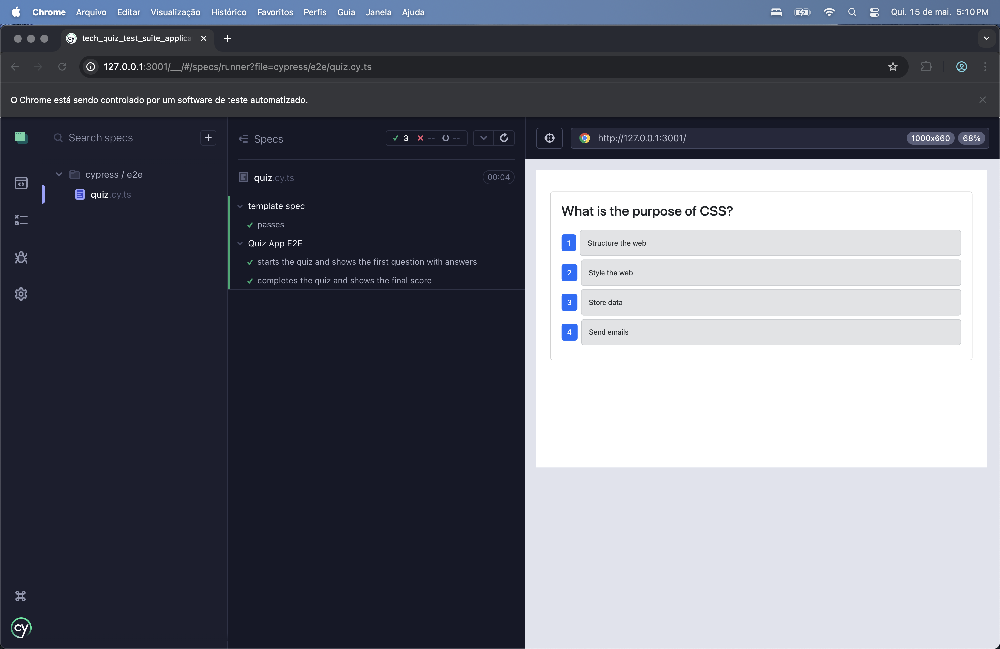

# Tech Quiz Test Suite Application

[](LICENSE)

---

## 📚 About the project

This project is a tech quiz web application built with the MERN stack (MongoDB, Express.js, React.js, Node.js) that allows users to test their knowledge by answering a quiz of ten random questions. The main focus of the project is to ensure the reliability of the application through automated testing using Cypress for component testing and end-to-end (E2E) testing.

---

## 📸 Screenshots

<div>
<p>| Home Screen |</p>

  
<p>| Quiz Question |</p> 

  
<p>| Final Result |</p> 

  
</div>


---

## 🛠 Technologies Used

- **Front-end:** React.js
- **Back-end:** Node.js, Express.js
- **Database:** MongoDB
- **Tests:** Cypress (Components and End-to-End)
- **Tools:** Git, VSCode, Insomnia

---

## ⚙️ How to run locally

### Prerequisites

- Node.js (v16+ recommended)
- MongoDB (Atlas)
- NPM or Yarn

### Steps

1. Clone the repository

```bash
git clone https://github.com/ThayRibeiro0/tech_quiz_test_suite_application.git
cd tech_quiz_test_suite_application
```

2. Set environment variables

Create an `.env` and set the variables according to your environment.

``` bash 
MONGODB_URI='your URI'
```


3. Install server and client dependencies

```bash
npm install
```

4. Start the server and client (in separate terminals)

```bash
cd server
npm run build
npm run seed
npm run start

cd ../client
npm run build
npm run dev
```

5. Access `http://127.0.0.1:3001/` in the browser to use the application.

---

## 🧪 How to run Cypress tests

To run all tests (components and e2e):

```bash
cd ../cypress
npm run cypress
```

This command runs the Cypress tests and should show all tests passing successfully.

---

## 🎥 Demo video

[Link to video walkthrough of the project and tests](https://www.loom.com/share/6b09b1c6c2f6467c9fa91c848c7b031d?sid=6efbec58-84a5-4e4e-94fc-b268ddd7c3c6) 

---

## 🤝 Credits

- Starter code base provided by the UCI bootcamp.
- README base inspired on my MindMotion template.
- Tests implemented using Cypress.

---

## 📄 License

This project is under the MIT license.